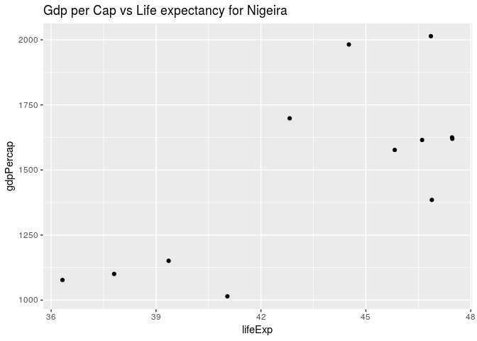
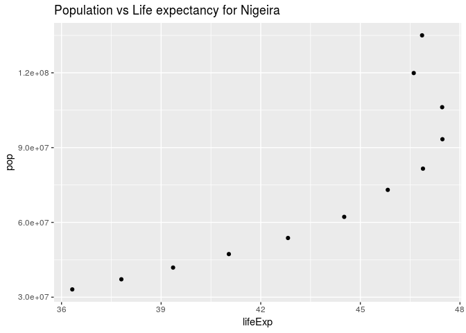

Let us beging by loading the necessary packages required for this exercise


```r
suppressPackageStartupMessages(library(tidyverse))
```

```
## Warning in .doLoadActions(where, attach): trying to execute load actions
## without 'methods' package
```

```
## Warning: replacing previous import by 'tibble::as_tibble' when loading
## 'broom'
```

```
## Warning: replacing previous import by 'tibble::tibble' when loading 'broom'
```

```r
library(ggplot2)
```


We begin by loading the extracted gapminder data for Nigeria only from the `gap_extract.csv` file. Let us use this data for some exercise


```r
gap_data <- read.csv(file="gap_extract.csv", header = TRUE, sep=",")
```

Let us display the structure of the data frame we extracted:


```r
str(gap_data)
```

```
## 'data.frame':	12 obs. of  6 variables:
##  $ country  : Factor w/ 1 level "Nigeria": 1 1 1 1 1 1 1 1 1 1 ...
##  $ continent: Factor w/ 1 level "Africa": 1 1 1 1 1 1 1 1 1 1 ...
##  $ year     : int  1952 1957 1962 1967 1972 1977 1982 1987 1992 1997 ...
##  $ lifeExp  : num  36.3 37.8 39.4 41 42.8 ...
##  $ pop      : int  33119096 37173340 41871351 47287752 53740085 62209173 73039376 81551520 93364244 106207839 ...
##  $ gdpPercap: num  1077 1101 1151 1015 1698 ...
```

we can also view the first few rows of the data 


```r
gap_data %>% 
	head() %>%
	knitr::kable()
```


country   continent    year   lifeExp        pop   gdpPercap
--------  ----------  -----  --------  ---------  ----------
Nigeria   Africa       1952    36.324   33119096    1077.282
Nigeria   Africa       1957    37.802   37173340    1100.593
Nigeria   Africa       1962    39.360   41871351    1150.927
Nigeria   Africa       1967    41.040   47287752    1014.514
Nigeria   Africa       1972    42.821   53740085    1698.389
Nigeria   Africa       1977    44.514   62209173    1981.952

Let us plot the `gdpPercap` vs `LifeExp`


```r
gap_data %>%
	ggplot(aes(lifeExp,gdpPercap) ) + 
	geom_point() +  ggtitle("Gdp per Cap vs Life expectancy for Nigeira")
```

<!-- -->

Let us plot the `pop` vs `LifeExp`


```r
gap_data %>%
	ggplot(aes(lifeExp,pop) ) + 
	geom_point() +  ggtitle("Population vs Life expectancy for Nigeira")
```

<!-- -->


Let us extract some columns of the `gad_data` and write it into a file in `.csv` format


```r
Nig_data <- gap_data %>%
	select(year,gdpPercap,pop,lifeExp)

write.csv(Nig_data,"Nig_data.csv",row.names = FALSE, quote = FALSE)
```


