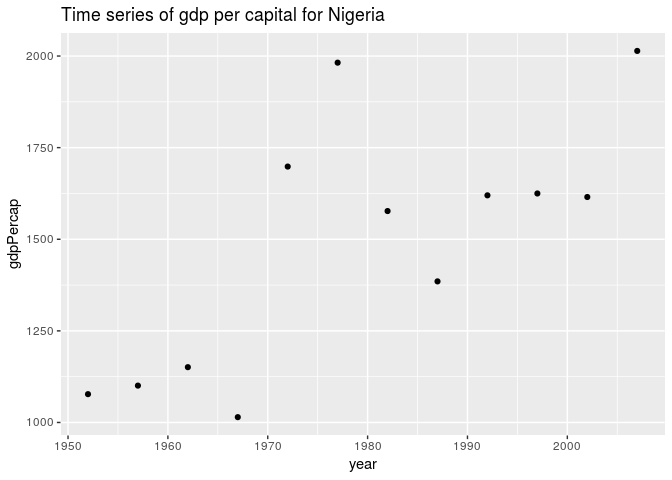

Let us beging by loading the necessary packages required for this exercise


```r
suppressPackageStartupMessages(library(tidyverse))
```

```
## Warning in .doLoadActions(where, attach): trying to execute load actions
## without 'methods' package
```

```
## Warning: replacing previous import by 'tibble::as_tibble' when loading
## 'broom'
```

```
## Warning: replacing previous import by 'tibble::tibble' when loading 'broom'
```

```r
library(ggplot2)
```


We begin by loading the extracted  data frame from the `Nig_data.csv` file. We shall use the data to produce time series graphs of `gdpPercap`, `lifeExp`, and `pop` (population)


```r
Nig_df <- read.csv(file="Nig_data.csv", header = TRUE, sep=",")
```


we can also view the first few rows of the data as follows


```r
Nig_df %>% 
	head() %>%
	knitr::kable()
```


 year   gdpPercap        pop   lifeExp
-----  ----------  ---------  --------
 1952    1077.282   33119096    36.324
 1957    1100.593   37173340    37.802
 1962    1150.927   41871351    39.360
 1967    1014.514   47287752    41.040
 1972    1698.389   53740085    42.821
 1977    1981.952   62209173    44.514

Let us plot the `gdpPercap` for Nigeria over time from 1952 to 2007


```r
Nig_df %>%
	ggplot(aes(year,gdpPercap) ) +  
	geom_point() +  ggtitle("Time series of gdp per capital for Nigeria")
```

<!-- -->

`lifeExp` for Nigeria over time from 1952 to 2007


```r
Nig_df %>%
	ggplot(aes(year,lifeExp ))  + 
	geom_point() +  ggtitle("Time series of  life expectancy of Nigeira")
```

<!-- -->


`pop` for Nigeria over time from 1952 to 2007


```r
Nig_df %>%
	ggplot(aes(year,pop)) + 
	geom_point() +  ggtitle("Time series of population of Nigeira")
```

<!-- -->


