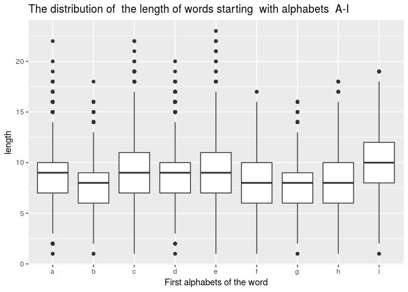
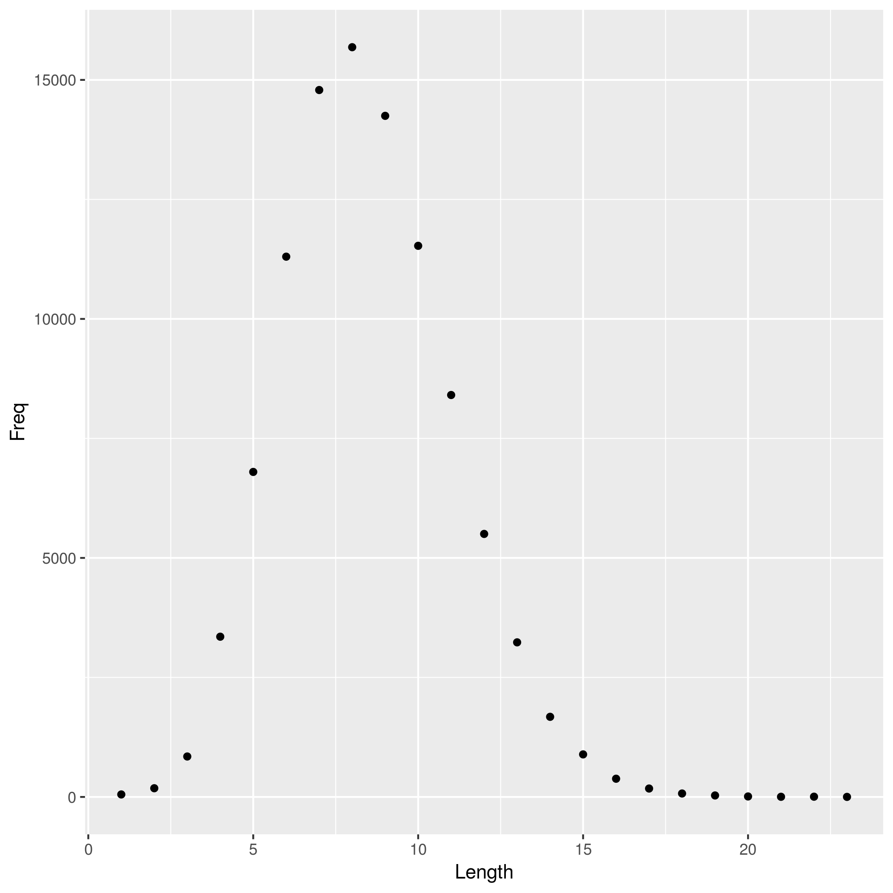

## In this file, we do some analysis of the data extracted from the `words.txt` data set

Let us begin by loading the necessary packages required for this exercise


```r
suppressPackageStartupMessages(library(tidyverse))
```

```
## Warning in .doLoadActions(where, attach): trying to execute load actions
## without 'methods' package
```

```
## Warning: replacing previous import by 'tibble::as_tibble' when loading
## 'broom'
```

```
## Warning: replacing previous import by 'tibble::tibble' when loading 'broom'
```

```r
suppressPackageStartupMessages(library(ggplot2))
```


Next, we  load the extracted data from file. This is the data containing words starting from with the alphabets A-I (both lower and upper case)


```r
sub_data <- read.csv(file="df_words.csv", header = TRUE, sep=",")
```

Let us display the structure of the data frame we created


```r
str(sub_data)
```

```
## 'data.frame':	46212 obs. of  3 variables:
##  $ First.alp: Factor w/ 9 levels "a","b","c","d",..: 1 1 1 1 1 1 1 1 1 1 ...
##  $ A.E.words: Factor w/ 45553 levels "a","aachen","aaliyah",..: 1 4651 9 266 160 781 785 1875 1761 2835 ...
##  $ length   : int  1 3 4 4 5 4 6 4 6 4 ...
```

we can also view the first few rows of the data frame


```r
sub_data %>% 
	head(10) %>%
	knitr::kable()
```


First.alp   A.E.words    length
----------  ----------  -------
a           a                 1
a           a's               3
a           aa's              4
a           ab's              4
a           abm's             5
a           ac's              4
a           acth's            6
a           ai's              4
a           aids's            6
a           am's              4

Let us plot a boxplot showing the distribution of the  length of words whose first characters are the alphabets a-i.


```r
sub_data %>%
	ggplot(aes(First.alp,length) ) + 
		geom_boxplot()  + labs(x = "First alphabets of the word")   + 
		ggtitle("The distribution of  the length of words starting  with alphabets  A-I")
```

<!-- -->


Below is the result of the analysis done in the pipeline seeded with the homework repository. This analysis shows the distribution of the length words in the data set. Here is a histogram of word lengths.




